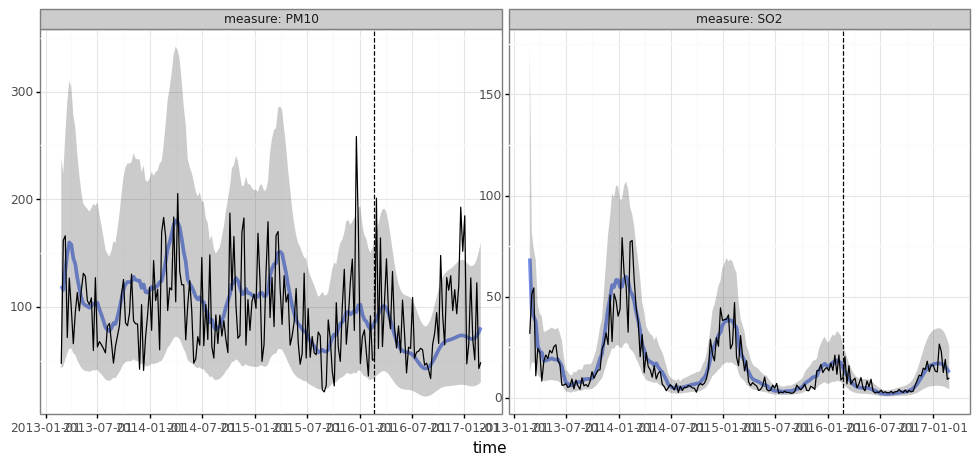
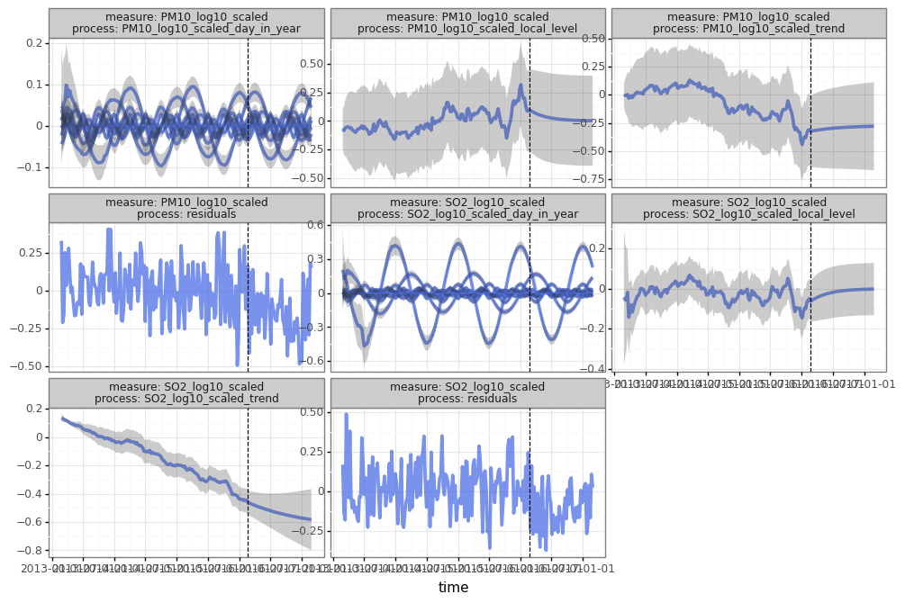
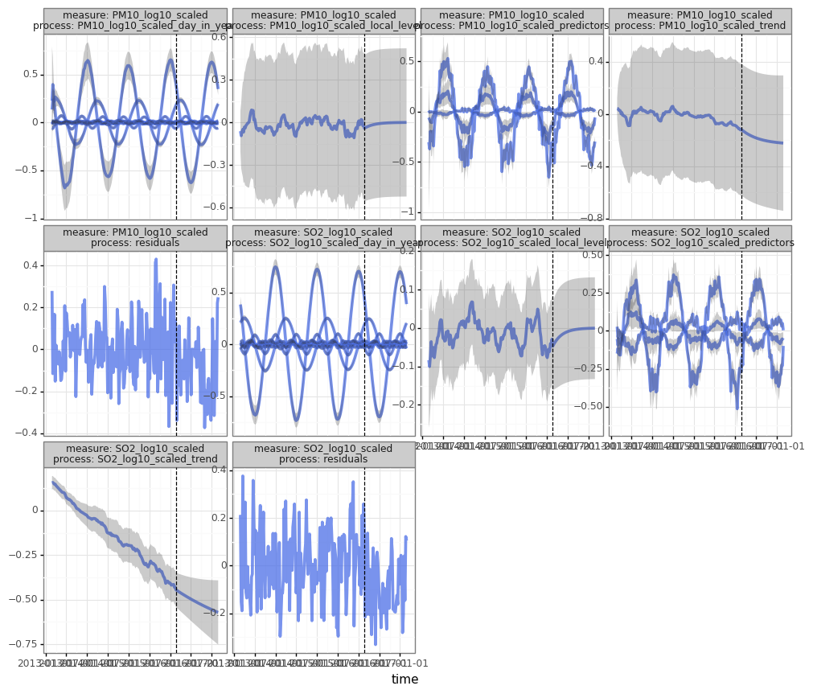
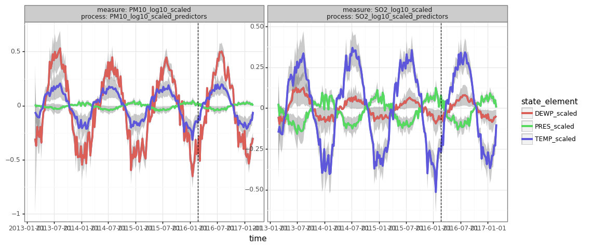

# Torch-Kalman

Time-series forecasting models using Kalman-filters in PyTorch.

## Table of Contents

- [Installation](#Installation)
- [Example: Beijing Multi-Site Air-Quality Dataset](#Example-Beijing-Multi-Site–Air-Quality-Dataset)
  * [Prepare Our Dataset](#Prepare-our-Dataset)
  * [Specify Our Model](#Specify-our-model)
  * [Visualize the Results](#Visualize-the-results)
  * [Using Predictors](#Using-predictors)

## Installation

```
pip install git+https://github.com/strongio/torch-kalman.git#egg=torch_kalman
```

## Example: Beijing Multi-Site Air-Quality Dataset

This dataset comes from the [UCI Machine Learning Data Repository](https://archive.ics.uci.edu/ml/datasets/Beijing+Multi-Site+Air-Quality+Data). It includes data on air pollutants and weather from 12 sites. To simplify the example, we'll focus on weekly averages for two measures: PM10 and SO2. Since these measures are strictly positive, we log-transform them.


```python
df_aq_weekly.loc[:,['date','station','SO2','PM10','TEMP','PRES','DEWP']]
```


<div>
<style scoped>
    .dataframe tbody tr th:only-of-type {
        vertical-align: middle;
    }

    .dataframe tbody tr th {
        vertical-align: top;
    }

    .dataframe thead th {
        text-align: right;
    }
</style>
<table border="1" class="dataframe">
  <thead>
    <tr style="text-align: right;">
      <th></th>
      <th>date</th>
      <th>station</th>
      <th>SO2</th>
      <th>PM10</th>
      <th>TEMP</th>
      <th>PRES</th>
      <th>DEWP</th>
    </tr>
  </thead>
  <tbody>
    <tr>
      <th>0</th>
      <td>2013-02-25</td>
      <td>Aotizhongxin</td>
      <td>36.541667</td>
      <td>57.791667</td>
      <td>2.525000</td>
      <td>1022.777778</td>
      <td>-15.666667</td>
    </tr>
    <tr>
      <th>1</th>
      <td>2013-03-04</td>
      <td>Aotizhongxin</td>
      <td>65.280906</td>
      <td>198.149701</td>
      <td>7.797619</td>
      <td>1008.958929</td>
      <td>-7.088690</td>
    </tr>
    <tr>
      <th>2</th>
      <td>2013-03-11</td>
      <td>Aotizhongxin</td>
      <td>57.416667</td>
      <td>177.184524</td>
      <td>6.402976</td>
      <td>1014.233929</td>
      <td>-2.277976</td>
    </tr>
    <tr>
      <th>3</th>
      <td>2013-03-18</td>
      <td>Aotizhongxin</td>
      <td>19.750000</td>
      <td>92.511905</td>
      <td>4.535119</td>
      <td>1009.782738</td>
      <td>-5.529762</td>
    </tr>
    <tr>
      <th>4</th>
      <td>2013-03-25</td>
      <td>Aotizhongxin</td>
      <td>41.559006</td>
      <td>145.422619</td>
      <td>6.991071</td>
      <td>1012.829762</td>
      <td>-3.762500</td>
    </tr>
    <tr>
      <th>...</th>
      <td>...</td>
      <td>...</td>
      <td>...</td>
      <td>...</td>
      <td>...</td>
      <td>...</td>
      <td>...</td>
    </tr>
    <tr>
      <th>2515</th>
      <td>2017-01-30</td>
      <td>Wanshouxigong</td>
      <td>27.666667</td>
      <td>119.059524</td>
      <td>0.768304</td>
      <td>1024.101984</td>
      <td>-18.331548</td>
    </tr>
    <tr>
      <th>2516</th>
      <td>2017-02-06</td>
      <td>Wanshouxigong</td>
      <td>15.544910</td>
      <td>61.395210</td>
      <td>0.625298</td>
      <td>1025.392857</td>
      <td>-16.977381</td>
    </tr>
    <tr>
      <th>2517</th>
      <td>2017-02-13</td>
      <td>Wanshouxigong</td>
      <td>26.166667</td>
      <td>139.613095</td>
      <td>2.870238</td>
      <td>1019.840476</td>
      <td>-11.551190</td>
    </tr>
    <tr>
      <th>2518</th>
      <td>2017-02-20</td>
      <td>Wanshouxigong</td>
      <td>7.020833</td>
      <td>46.372414</td>
      <td>3.425000</td>
      <td>1022.414881</td>
      <td>-11.811905</td>
    </tr>
    <tr>
      <th>2519</th>
      <td>2017-02-27</td>
      <td>Wanshouxigong</td>
      <td>9.613636</td>
      <td>52.955556</td>
      <td>9.647917</td>
      <td>1016.014583</td>
      <td>-9.964583</td>
    </tr>
  </tbody>
</table>
<p>2520 rows × 7 columns</p>
</div>


#### Prepare our Dataset

One of the key advantages of `torch-kalman` is the ability to train on a batch of time-serieses, instead of training a separate model for each individually. The `TimeSeriesDataset` is similar to PyTorch's native `TensorDataset`, with some useful metadata on the batch of time-serieses (the station names, the dates for each).


```python
# preprocess our measures of interest:
measures = ['SO2','PM10']
measures_pp = [m + '_log10_scaled' for m in measures]
df_aq_weekly[measures_pp] = np.log10(df_aq_weekly[measures] / col_means[measures])

# create a dataset:
dataset_all = TimeSeriesDataset.from_dataframe(
    dataframe=df_aq_weekly,
    dt_unit='W',
    measure_colnames=measures_pp,
    group_colname='station', 
    time_colname='date'
)

# Train/Val split:
dataset_train, dataset_val = dataset_all.train_val_split(dt=SPLIT_DT)
dataset_train, dataset_val
```


    (TimeSeriesDataset(sizes=[torch.Size([12, 156, 2])], measures=(('SO2_log10_scaled', 'PM10_log10_scaled'),)),
     TimeSeriesDataset(sizes=[torch.Size([12, 54, 2])], measures=(('SO2_log10_scaled', 'PM10_log10_scaled'),)))


#### Specify our Model

The `KalmanFilter` subclasses `torch.nn.Module`. We specify the model by passing `processes` that capture the behaviors of our `measures`.


```python
processes = []
for measure in measures_pp:
    processes.extend([
        LocalTrend(id=f'{measure}_trend', measure=measure),
        LocalLevel(id=f'{measure}_local_level', decay=(.90,1.00), measure=measure),
        FourierSeason(id=f'{measure}_day_in_year', period=365.25 / 7., dt_unit='W', K=4, measure=measure)
    ])

#
predict_variance = torch.nn.Embedding(
                num_embeddings=len(dataset_all.group_names), embedding_dim=len(measures_pp), padding_idx=0
            )
group_names_to_group_ids = {g : i for i,g in enumerate(dataset_all.group_names)}

kf_first = KalmanFilter(
    measures=measures_pp, 
    processes=processes,
    measure_covariance=Covariance.for_measures(measures_pp, var_predict={'group_ids' : predict_variance})
)
```

Here we're showing off a few useful features of `torch-kalman`:

- We are training on a multivarite time-series: that is, our time-series has two measures (SO2 and PM10) and our model will capture correlations across these.
- We are going to train on, and predictor for, multiple time-serieses (i.e. multiple stations) at once. 
- We are predicting the variance from the groups -- i.e., we are giving each group its own variance-estimate.

#### Train our Model

When we call our KalmanFilter, we get predictions which come with a mean and covariance, and so can be evaluated against the actual data using a (negative) log-probability critierion.


```python
kf_first.opt = LBFGS(kf_first.parameters(), max_iter=10, line_search_fn='strong_wolfe')

def closure():
    kf_first.opt.zero_grad()
    pred = kf_first(
        dataset_train.tensors[0], 
        start_datetimes=dataset_train.start_datetimes, 
        group_ids=[group_names_to_group_ids[g] for g in dataset_train.group_names]
    )
    loss = -pred.log_prob(dataset_train.tensors[0]).mean()
    loss.backward()
    return loss

for epoch in range(12):
    train_loss = kf_first.opt.step(closure).item()
    with torch.no_grad():
        pred = kf_first(
            dataset_val.tensors[0], 
            start_datetimes=dataset_val.start_datetimes,
            group_ids=[group_names_to_group_ids[g] for g in dataset_val.group_names]
        )
        val_loss = -pred.log_prob(dataset_val.tensors[0]).mean().item()
    print(f"EPOCH {epoch}, TRAIN LOSS {train_loss}, VAL LOSS {val_loss}")
```

    /Users/jacobdink/Documents/python-projects/torch-kalman/torch_kalman/internals/utils.py:21: UserWarning: This overload of nonzero is deprecated:
    	nonzero()
    Consider using one of the following signatures instead:
    	nonzero(*, bool as_tuple) (Triggered internally at  /Users/distiller/project/conda/conda-bld/pytorch_1603740477510/work/torch/csrc/utils/python_arg_parser.cpp:882.)
      group_idx = (c1 & c2).nonzero().view(-1)


    EPOCH 0, TRAIN LOSS 2.3094546794891357, VAL LOSS -0.5816877484321594
    EPOCH 1, TRAIN LOSS -0.6860888004302979, VAL LOSS -0.4119633436203003
    EPOCH 2, TRAIN LOSS -0.8100854754447937, VAL LOSS -0.4584827125072479
    EPOCH 3, TRAIN LOSS -0.8445957899093628, VAL LOSS -0.5061981678009033
    EPOCH 4, TRAIN LOSS -0.8639442324638367, VAL LOSS -0.5387625694274902
    EPOCH 5, TRAIN LOSS -0.8791329264640808, VAL LOSS -0.6225013732910156
    EPOCH 6, TRAIN LOSS -0.8944583535194397, VAL LOSS -0.683154284954071
    EPOCH 7, TRAIN LOSS -0.908904492855072, VAL LOSS -0.7305331826210022
    EPOCH 8, TRAIN LOSS -0.9150485992431641, VAL LOSS -0.7309569120407104
    EPOCH 9, TRAIN LOSS -0.9249271750450134, VAL LOSS -0.6934330463409424
    EPOCH 10, TRAIN LOSS -0.9311220645904541, VAL LOSS -0.6813281774520874
    EPOCH 11, TRAIN LOSS -0.935217559337616, VAL LOSS -0.6527152061462402


#### Visualize the Results


```python
def inverse_transform(df: pd.DataFrame, col_means: pd.Series) -> pd.DataFrame:
    df = df.copy()
    df['measure'] = df['measure'].str.replace('_log10_scaled','')
    std = (df['upper'] - df['lower']) / 1.96
    for col in ['mean','lower','upper','actual']:
        if col == 'mean':
            # bias correction:
            df[col] = df[col] + .5 * std ** 2
        df[col] = 10 ** df[col] # inverse log10
        df[col] *= df['measure'].map(col_means.to_dict()) # inverse scaling
    return df

with torch.no_grad():
    pred = kf_first(
        dataset_train.tensors[0], 
        start_datetimes=dataset_train.start_datetimes,
        group_ids=[group_names_to_group_ids[g] for g in dataset_train.group_names],
        out_timesteps=dataset_all.tensors[0].shape[1]
    )

df_pred = inverse_transform(pred.to_dataframe(dataset_all), col_means)

print(pred.plot(df_pred.query("group=='Changping'"), split_dt=SPLIT_DT))
```

    /Users/jacobdink/miniconda3/envs/nuenergen-enertrac/lib/python3.8/site-packages/plotnine/facets/facet.py:549: PlotnineWarning: If you need more space for the x-axis tick text use ... + theme(subplots_adjust={'wspace': 0.25}). Choose an appropriate value for 'wspace'.


    

    


    <ggplot: (8794281264713)>


```python
print(pred.plot(pred.to_dataframe(dataset_all, type='components').query("group=='Changping'"), split_dt=SPLIT_DT))
```

    /Users/jacobdink/miniconda3/envs/nuenergen-enertrac/lib/python3.8/site-packages/plotnine/facets/facet.py:549: PlotnineWarning: If you need more space for the x-axis tick text use ... + theme(subplots_adjust={'wspace': 0.25}). Choose an appropriate value for 'wspace'.


    

    


    <ggplot: (8794281637949)>


#### Using Predictors

Here, we'll use the weather to predict our measures of interest. We add these predictors by adding a `LinearModel` process to our model. `torch-kalman` also supports using *any* neural network to generate latent states for our model -- see the `NN` process.


```python
predictors = ['TEMP', 'PRES', 'DEWP']
predictors_pp = [x + '_scaled' for x in predictors]

df_aq_weekly[predictors_pp] = (df_aq_weekly[predictors] - col_means[predictors]) / col_stds[predictors]

dataset_all = TimeSeriesDataset.from_dataframe(
    dataframe=df_aq_weekly,
    dt_unit='W',
    group_colname='station',
    time_colname='date',
    y_colnames=measures_pp,
    X_colnames=predictors_pp
)

dataset_train, dataset_val = dataset_all.train_val_split(dt=SPLIT_DT)

# impute nans (since standardized, imputing w/zeros means imputing w/mean)
for _dataset in (dataset_all, dataset_train, dataset_val):
    _, X = _dataset.tensors
    X[torch.isnan(X)] = 0.0
```


```python
kf_pred = KalmanFilter(
    measures=measures_pp,
    processes=[deepcopy(p) for p in processes] + [
        LinearModel(id=f'{m}_predictors', predictors=predictors_pp, measure=m)
        for m in measures_pp
    ],
    measure_covariance=Covariance.for_measures(measures_pp, var_predict={'group_ids' : deepcopy(predict_variance)})
)

kf_pred.opt = LBFGS(kf_pred.parameters(), max_iter=10, line_search_fn='strong_wolfe')

def closure():
    kf_pred.opt.zero_grad()
    y, X = dataset_train.tensors
    pred = kf_pred(
        y, 
        X=X, 
        start_datetimes=dataset_train.start_datetimes, 
        group_ids=[group_names_to_group_ids[g] for g in dataset_train.group_names]
    )
    loss = -pred.log_prob(y).mean()
    loss.backward()
    return loss

for epoch in range(15):
    train_loss = kf_pred.opt.step(closure).item()
    y, X = dataset_val.tensors
    with torch.no_grad():
        pred = kf_pred(
            y, 
            X=X, 
            start_datetimes=dataset_val.start_datetimes, 
            group_ids=[group_names_to_group_ids[g] for g in dataset_val.group_names]
        )
        val_loss = -pred.log_prob(y).mean().item()
    print(f"EPOCH {epoch}, TRAIN LOSS {train_loss}, VAL LOSS {val_loss}")
```

    EPOCH 0, TRAIN LOSS 2.439788818359375, VAL LOSS 0.042325180023908615
    EPOCH 1, TRAIN LOSS -0.888689398765564, VAL LOSS -0.6226305365562439
    EPOCH 2, TRAIN LOSS -0.9990025758743286, VAL LOSS -0.6390435695648193
    EPOCH 3, TRAIN LOSS -1.0735762119293213, VAL LOSS -0.6287018656730652
    EPOCH 4, TRAIN LOSS -1.1046671867370605, VAL LOSS -0.5175223350524902
    EPOCH 5, TRAIN LOSS -1.1253938674926758, VAL LOSS -0.5689218044281006
    EPOCH 6, TRAIN LOSS -1.1366777420043945, VAL LOSS -0.5966846942901611
    EPOCH 7, TRAIN LOSS -1.143223762512207, VAL LOSS -0.6886044144630432
    EPOCH 8, TRAIN LOSS -1.14899480342865, VAL LOSS -0.7130133509635925
    EPOCH 9, TRAIN LOSS -1.1522138118743896, VAL LOSS -0.7169275879859924
    EPOCH 10, TRAIN LOSS -1.1553481817245483, VAL LOSS -0.7140083909034729
    EPOCH 11, TRAIN LOSS -1.1583540439605713, VAL LOSS -0.6799390316009521
    EPOCH 12, TRAIN LOSS -1.1606409549713135, VAL LOSS -0.6513524651527405
    EPOCH 13, TRAIN LOSS -1.1625326871871948, VAL LOSS -0.5699852108955383
    EPOCH 14, TRAIN LOSS -1.1652331352233887, VAL LOSS -0.4974578022956848


```python
y, _ = dataset_train.tensors # only input air-pollutant data from 'train' period
_, X = dataset_all.tensors # but provide exogenous predictors from both 'train' and 'validation' periods
with torch.no_grad():
    pred = kf_pred(
        y, 
        X=X, 
        start_datetimes=dataset_train.start_datetimes,
        out_timesteps=X.shape[1],
        group_ids=[group_names_to_group_ids[g] for g in dataset_val.group_names]
    )

print(
    pred.plot(inverse_transform(pred.to_dataframe(dataset_all).query("group=='Changping'"), col_means),split_dt=SPLIT_DT)
)

df_components = pred.to_dataframe(dataset_all, type='components')

print(pred.plot(df_components.query("group=='Changping'"), split_dt=SPLIT_DT))
```

    /Users/jacobdink/miniconda3/envs/nuenergen-enertrac/lib/python3.8/site-packages/plotnine/facets/facet.py:549: PlotnineWarning: If you need more space for the x-axis tick text use ... + theme(subplots_adjust={'wspace': 0.25}). Choose an appropriate value for 'wspace'.


    

    


    <ggplot: (8794238694108)>


    /Users/jacobdink/miniconda3/envs/nuenergen-enertrac/lib/python3.8/site-packages/plotnine/facets/facet.py:549: PlotnineWarning: If you need more space for the x-axis tick text use ... + theme(subplots_adjust={'wspace': 0.25}). Choose an appropriate value for 'wspace'.


    

    


    <ggplot: (8794281696519)>


```python
print(pred.plot(df_components.query("(group=='Changping') & (process.str.endswith('predictors'))"), split_dt=SPLIT_DT))
```

    /Users/jacobdink/miniconda3/envs/nuenergen-enertrac/lib/python3.8/site-packages/plotnine/facets/facet.py:549: PlotnineWarning: If you need more space for the x-axis tick text use ... + theme(subplots_adjust={'wspace': 0.25}). Choose an appropriate value for 'wspace'.


    

    


    <ggplot: (8794239844783)>

